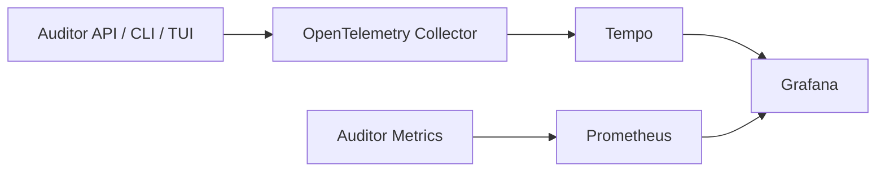

# Observabilidade

O Auditor IA produz logs estruturados com `log/slog`, métricas Prometheus e traces OpenTelemetry. Logs de produção usam JSON; desenvolvimento usa texto por padrão. Os três sinais compartilham `trace_id`, e as avaliações persistem esse identificador em `deal_assessments.trace_id`.



Nenhum log ou atributo deve conter webhook, `DATABASE_URL`, chave de API, prompt, resposta integral do modelo, texto de conversa, formulário, anexo, telefone, e-mail ou nome de cliente. Erros passam pelo sanitizador central antes do registro. Métricas usam somente labels controlados; IDs de negócio e avaliação nunca são labels.

## Configuração

- `LOG_LEVEL`: `DEBUG`, `INFO`, `WARN` ou `ERROR`.
- `LOG_FORMAT`: `text` ou `json`.
- `SERVICE_NAME` e `SERVICE_VERSION`: identidade do serviço.
- `METRICS_ADDR`: listener interno, padrão `:9091`.
- `READINESS_TIMEOUT` e `READINESS_CACHE_TTL`: limite e cache de `/ready`.
- `OTEL_TRACING_ENABLED`: ativa exportação OTLP. Desativado mantém operação normal.
- `OTEL_EXPORTER_OTLP_ENDPOINT`: collector OTLP gRPC, sem URL secreta.
- `OTEL_TRACES_SAMPLER_ARG`: razão entre `0` e `1`.

`GET /health` é apenas liveness. `GET /ready` consulta PostgreSQL, Bitrix e Ollama em paralelo, com cache e proteção contra avalanche. PostgreSQL indisponível resulta em `503/not_ready`; Bitrix ou Ollama indisponíveis resultam em `200/degraded`.

## Ambiente local

```powershell
docker compose --profile observability up -d
Invoke-RestMethod http://localhost:8080/health
Invoke-RestMethod http://localhost:8080/ready
Invoke-WebRequest http://localhost:9090/-/ready
docker compose --profile observability logs --tail 100 auditor-api
```

Grafana: `http://localhost:3000`. Prometheus: `http://localhost:9090`. PostgreSQL, Ollama, OTLP e o listener de métricas não são publicados no host.

O dashboard provisionado apresenta volume de auditorias, latência p95 e disponibilidade das dependências. Os alertas iniciais cobrem PostgreSQL indisponível, taxa de erros e latência alta.

## Métricas e labels

São expostos contadores para auditorias, negócios, mensagens, achados, chamadas externas, erros e relatórios; gauges para auditorias em andamento, dependências e modelo Ollama; histogramas para HTTP, auditoria, Bitrix, regras, Ollama, PostgreSQL, relatórios e dependências externas. Labels ficam limitados a `status`, `operation`, `dependency`, `severity`, `method` e rota normalizada. IDs, títulos, nomes, modelo informado pelo usuário e mensagens são proibidos como labels.

## Retenção, custo e limites

Prometheus, Tempo e Grafana usam volumes locais persistentes. A configuração de desenvolvimento não substitui políticas de retenção e backup de produção. Defina limites de armazenamento, amostragem de traces e retenção conforme o volume; amostrar tudo é útil localmente, mas pode ser caro em produção. A cardinalidade controlada evita crescimento provocado por IDs.

## Falhas e troubleshooting

- Collector indisponível: a aplicação continua operando; traces podem ser perdidos.
- PostgreSQL indisponível: `/ready` retorna `503`.
- Bitrix ou Ollama indisponível: `/ready` retorna `200` com estado `degraded`.
- Modelo ausente: confira `OLLAMA_MODEL` e `docker compose exec ollama ollama list`.
- Prometheus sem target: confira `http://localhost:9090/targets` e o listener interno `:9091`.
- Para desligar traces, use `OTEL_TRACING_ENABLED=false`; logs e métricas continuam ativos.

Em AWS, mantenha a instrumentação OTLP e troque os exporters do Collector: logs para CloudWatch, métricas para Amazon Managed Service for Prometheus, dashboards para Amazon Managed Grafana e traces para X-Ray. Credenciais devem vir de IAM/Secrets Manager, nunca de atributos ou logs.

## Diagnóstico

Use o `trace_id` retornado pela API ou consultado no PostgreSQL para localizar a avaliação no Tempo. Logs mantêm somente metadados seguros, então detalhes comerciais devem ser consultados pelos fluxos autenticados da API/TUI.
